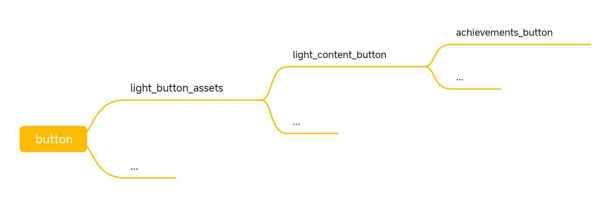

# Class3 UI文件的要素
让我们随便打开一个json，比如`start_screen.json`。
这整个文件的内容是游戏开始菜单的内容。
  
下面我们来看看一个ui所必备的要素。
## 命名空间
每一个UI文件必须要有一个*命名空间*，也就是给每个UI一个名字来用于区分它们，所以一个包内不能有两个相同的命名空间。
```json
"namespace": "start",
```
## 控件
这里的每个**对象**都是一个**控件**，控件的类型有很多种，但我们要从根本上了解它到底是什么。  
说白了，每个UI文件就是由**各种类型的**控件堆砌组成，但控件并不总是从创建开始就能在屏幕上显示的。  
现在我们来看一个完整的控件。
```json
  "achievements_icon": {
    "type": "image",
    "texture": "textures/ui/achievements",
    "layer": 3,
    "size": [ 16, 16 ]
  },
```
它很好懂，首先我们看到第一个参数`type`是`image`，也就是一个图片类型的控件。
> **提示：**基础课程不包含所有控件类型的详细介绍，这里只是帮助新手理解其概念。

其余参数分别代表着路径、层级、大小。
可是它到底只是一个图片，我们要用它来干什么，它应该出现在什么位置呢？这些均未被定义，因此，我们在文件中搜索一下这个图片有没有在其它地方被利用。
## 引用
我们找到了这个图片控件下一次出现的位置。
```json
  "achievements_button@common_buttons.light_content_button": {
    "size": [ 24, 24 ],
    "$button_content": "start.achievements_icon",
    "$pressed_button_name": "button.menu_achievements"
  },
```
这又是一个控件，可是我们在这里看不到它是什么类型的控件，连`type`都没有！  
因此我们来讲一讲**引用**的概念。  
首先我们看到这个奇怪的控件名`achievements_button@common_buttons.light_content_button`：  
在`@`之前的是本控件的名称，在`@`之后的是被引用的控件名。而这个被引用的控件名又分为两部分，`common_buttons`是所属其命名空间，`light_content_button`是在这个命名空间UI内的一个控件。这里要显示其命名空间的原因是这个被引用控件本身就属于另外一个文件，如果不标出它的来源，就无法精准的定位到。而我们如果在这里引用同一个文件的控件，就不需要写出其命名空间，它本身是可以省略的。比如说，我们看到
```json
"$button_content": "start.achievements_icon",
```
这个参数代表按钮内容，它就引用了刚刚那张图片，我们当然也可以将这里改写为
```json
"$button_content": "achievements_icon",
```
不会有任何问题。但这里的引用是一种单纯的读取，这个控件不仅对它引用，而且对其**覆写**成为了一个新的控件在这里。  
覆写很简单，**即将被引用控件完全复制过来，对其添加或修改成为了一个新的控件。**  
让我们找到这个`common_buttons.light_content_button`来看一下。  
通过搜索，我们找到了`ui_template_buttons.json`，它的命名空间就是`common_buttons`，随后我们再找到`light_content_button`：
```json
  "light_content_button@light_button_assets": {
    ...[略]
    }
```
再往下找到`light_button_assets`：  
```json
  "light_button_assets@common.button": {
  ...[略]
  }
```
继续找`common.button`：
```json
  "button": {
    "type": "button",
    ...[略]
  }
```
终于找到了，它的本质就是一个`button`类型的控件。  
通过上面的探索，我们发现了一个看似简单的控件可能要经过多层的引用或**覆写**，这是一种很方便的方式。

试想一下，当你想创建多个除了显示文字都一样的按钮时，你不需要把同一段代码复制多遍，而是通过引用，只用修改一段代码即可，即增加可读性又减少性能。
## 父子关系